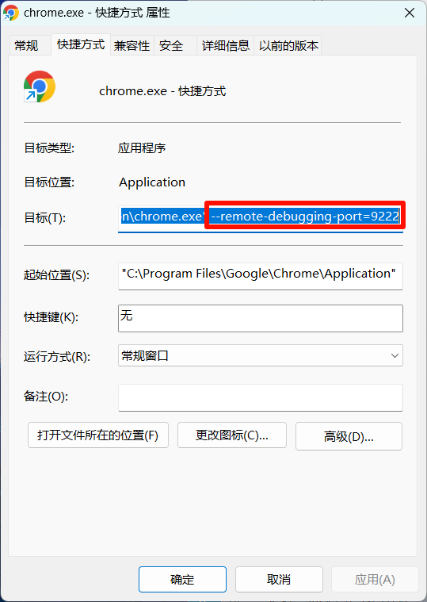

# auto-zhihuishu-watcher
 多线程20倍全自动刷智慧树视频时长

1. 用微软浏览器或者谷歌浏览器搞一个快捷方式,属性,目标，绑定端口如下图
   参考："C:\Program Files\Google\Chrome\Application\chrome.exe" --remote-debugging-port=9222
     

2. 用这个快捷方式登录账号
3. 打开所要刷的课程页面，然后点进下图这个页面
   在config.json中配置要刷的课程，只需要含有课程名称即可（课程名称可以不完整,但是一定要保证唯一）
     
4. 运行刷视频.py

注意：
1. 线程数如果开太高的话，网络可能会不够用，导致刷视频很卡，或者内存占用过高，导致程序崩溃
2. 好的电脑网速也快,可以开到十几个线程，如果对速度有要求，可以先开个10个线程。如果每个视频都不是很卡，看情况选择，服务器2核4G的亲测开2个线程，3个线程会崩
